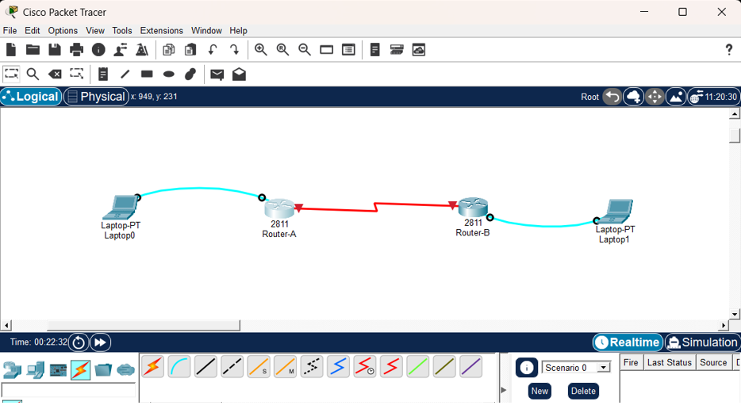
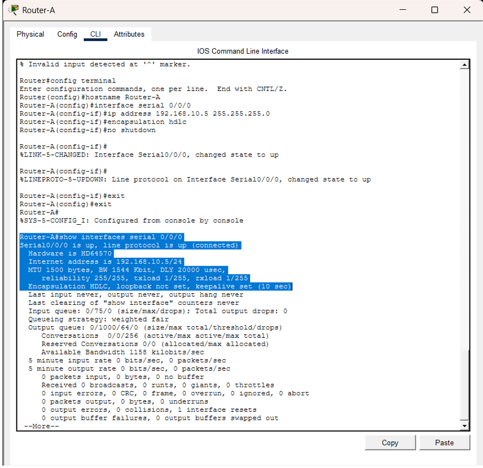
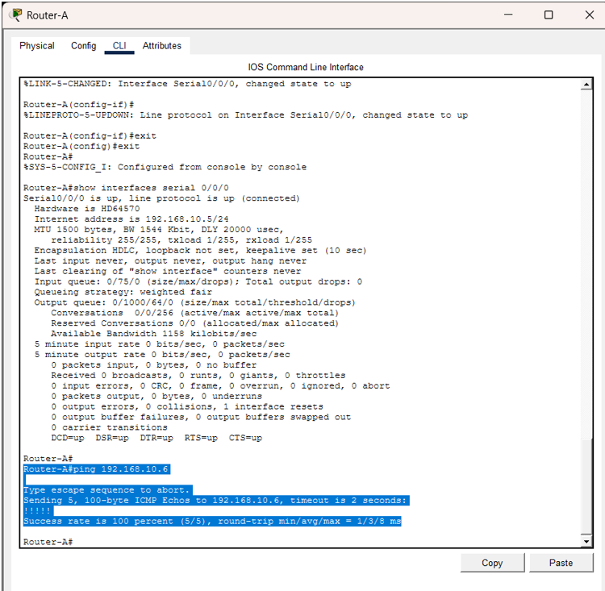
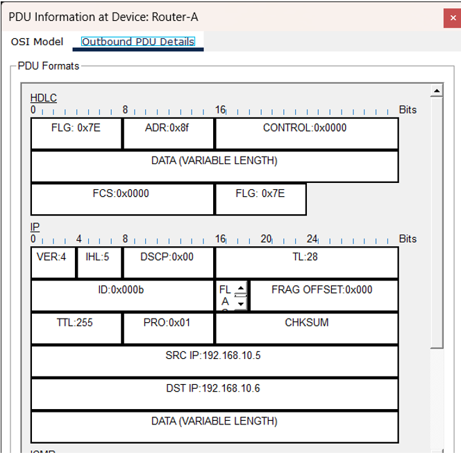

# hdlc-protocol-simulation
Theoretical analysis and practical simulation of Layer 2 HDLC/cHDLC encapsulation and data link mechanisms

# Cisco HDLC Protocol Simulation

A practical simulation of Layer 2 HDLC encapsulation over a point-to-point WAN link using Cisco Packet Tracer. The goal is to see exactly how IP packets are framed on the wire, focusing on Cisco's proprietary cHDLC format.

---

## 🛠 The Setup
* **Topology:** Built a point-to-point serial link (DCE/DTE) between two Cisco routers.
* **Configuration:** Applied the `encapsulation hdlc` command to enforce Cisco's framing. 
* **Verification:** Checked Layer 2 line protocols via `show interfaces serial` and validated end-to-end connectivity with ICMP pings.

---

## 🔍 Under the Hood: Cisco HDLC (cHDLC)
Standard ISO HDLC has a flaw: it doesn’t natively support multiple Layer 3 protocols. Cisco bypassed this by injecting a custom 2-byte **Protocol field** into the frame. 

Here is what the packet actually looks like on the wire:
* **Flag (`0x7E`):** Start/end marker. Uses bit-stuffing to prevent collisions.
* **Address & Control:** Standard P2P routing identifiers.
* **Protocol (Cisco specific):** Tells the router what's inside the payload (e.g., `0x0800` means it's an IPv4 packet).
* **Information:** The actual Layer 3 payload.
* **FCS:** Standard CRC for error checking.

---

## 📸 Simulation Gallery

| Network Topology | HDLC Interface Verification | End-to-End Ping Test |
| :---: | :---: | :---: |
|  |  |  |

---
##  Advanced cHDLC Frame Analysis

In a synchronous WAN environment, Layer 2 encapsulation is critical for data integrity. Unlike standard ISO HDLC, this project utilizes **Cisco HDLC (cHDLC)**, which adds a "Protocol" field to support multi-protocol environments.

##  Tools & Concepts
* **Environment:** Cisco Packet Tracer
* **Key Concepts:** Wide Area Networks (WAN), Data Link Layer (OSI Layer 2), HDLC/cHDLC Encapsulation, Serial Communication (DCE/DTE), Synchronous Transmission.
